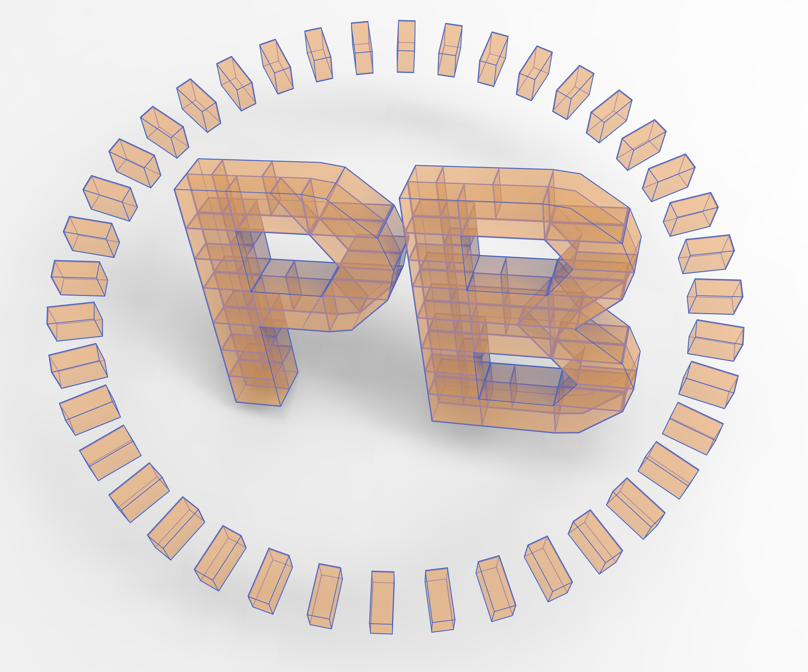
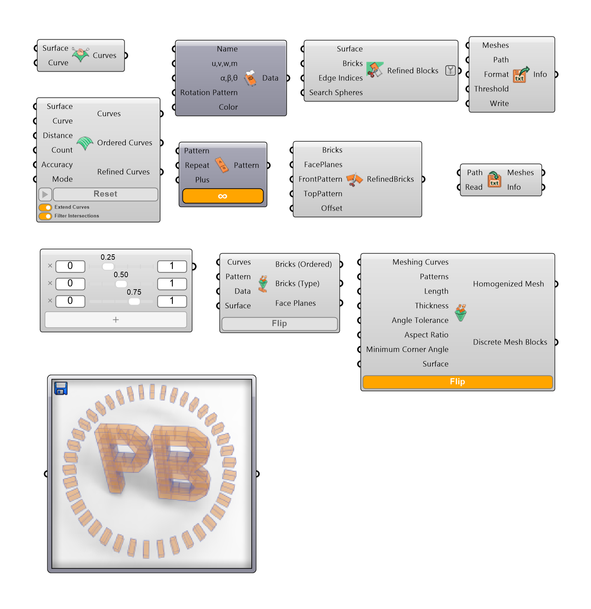

#  
# PoliBrick
**PoliBrick** is a parametric plugin for Rhinoceros and Grasshopper specifically designed for the digital modelling of complex brick stereotomy on free-form surfaces
## Features
- **Structural Integration**: Exports Grasshopper Mesh geometry to 3DEC,Straus7 and MATLAB with correct syntax.
- **Alphabetical Patterning**: Employs a novel string-based logic (e.g., A, B, S) to replicate intricate patterns like herringbone, basket weave, and stretcher bonds.

*(verview of the PoliBrick component family)*

## Installation
1. Go to the [Releases](../../releases) page.
2. Download the `PoliBrick.gha` file.
3. In Grasshopper, go to `File > Special Folders > Components Folder`.
4. Paste the `.gha` file there.
5. Right-click the file > **Properties** > **Unblock** (if necessary).
6. Restart Rhino/Grasshopper.

## Example
Check the `Examples/` folder for a sample:
- `Example File.gh`: The Grasshopper generation script.

## Requirements
- Rhinoceros 6 or 7
- Itasca 3DEC 5.2 (for running the output)

## Technical Collaboration
PoliBrick was developed by **Mohammad Pourfouladi** in collaboration with **Natalia Pingaro** (Politecnico di Milano)

## Reference Paper
Pourfouladi, M., Pingaro, N., & Valente, M. (2025b). PoliBrick plugin as a parametric tool for digital stereotomy modelling. Computers & Structures, 311, 107722.[![Paper Link]](https://doi.org/10.1016/j.compstruc.2025.107722 )

## License
This project is licensed under the MIT License.
